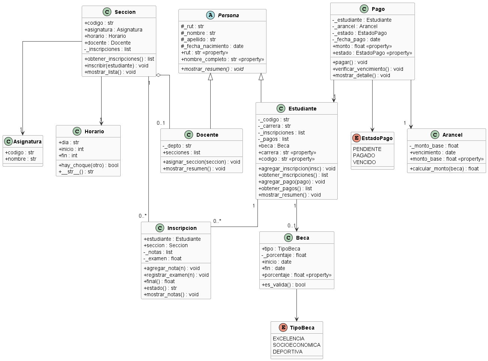

Sistema de Gestion Academica
Sistema de consola en Python para gestionar estudiantes, docentes, inscripciones, calificaciones y pagos de una universidad.
Lenguaje y tecnologias
Python 3.10+
PlantUML para el diagrama de clases
Estructura;

main.py,
diagrama.puml,       L
 diagrama.png,          
README.md


### Por Terminal (Recomendado)

Requisito: tener Python 3.10 o superior instalado.

```bash
# 1. Navegar a la carpeta del proyecto
cd "ruta/a/tu/carpeta/Evaluación Sumativa Final-Freddy Caneo"

# 2. Ejecutar el sistema
python main.py
```

**En Windows (PowerShell o CMD):**
powershell:
python main.py


**En macOS o Linux (Terminal):**
```bash
python3 main.py
```

Al ejecutar, se muestra un menú interactivo en la consola para navegar entre las opciones.

### Con Visual Studio Code (Opcional)

Si usas Visual Studio Code, instala estas extensiones recomendadas:

1. **Python** (Microsoft)
   - Ejecuta y depura código Python
  

2. **PlantUML** (jebbs)
   - Visualiza el diagrama de clases (.puml)

3. **Markdown All in One** (Yu Zhang) - Opcional
   - Mejora la edición del README


**Para ejecutar en VSCode:**
- Abre `main.py` → Click derecho → "Run Python File in Terminal"
- O presiona `Ctrl + F5` (Windows) / `Cmd + F5` (Mac)
- Ctrl + shift + p : para descargar imagen de plantuml

Funcionalidades:
Lista de estudiantes y docentes
Inscribir el respectivo estudiante en su debida seccion
Registrar notas parciales y examen
Calcular nota final y estado (aprobado/eprobado)
Gestionar pagos de arancel con descuento por beca
Consultar horarios por seccion

## Diagrama de clases



